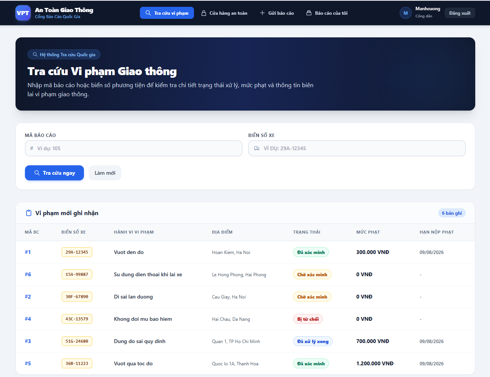
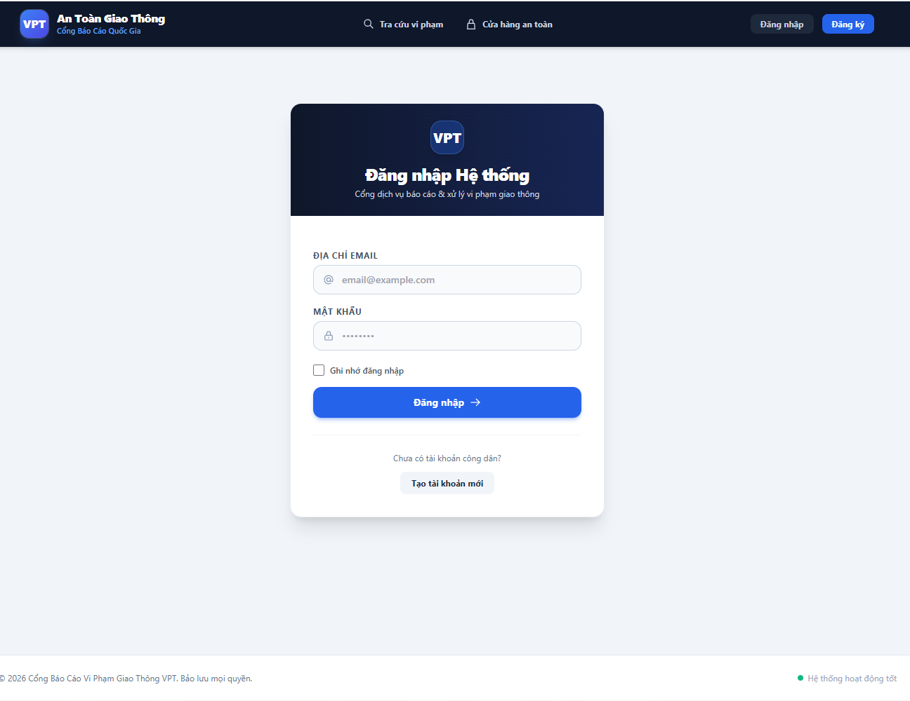
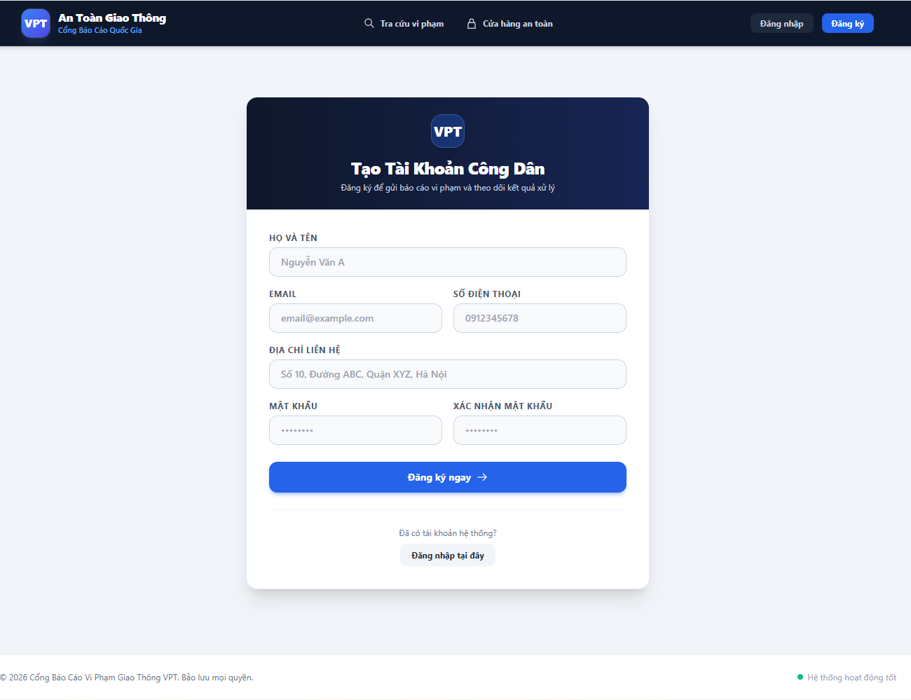
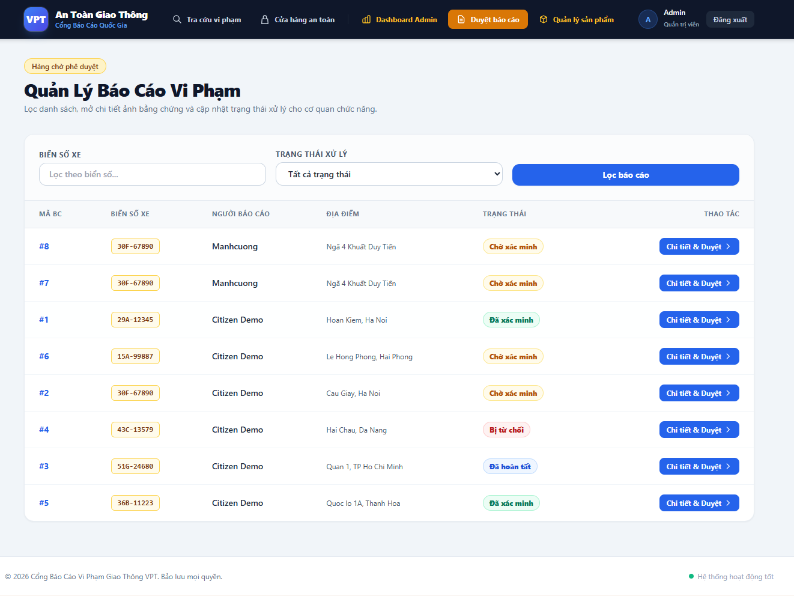
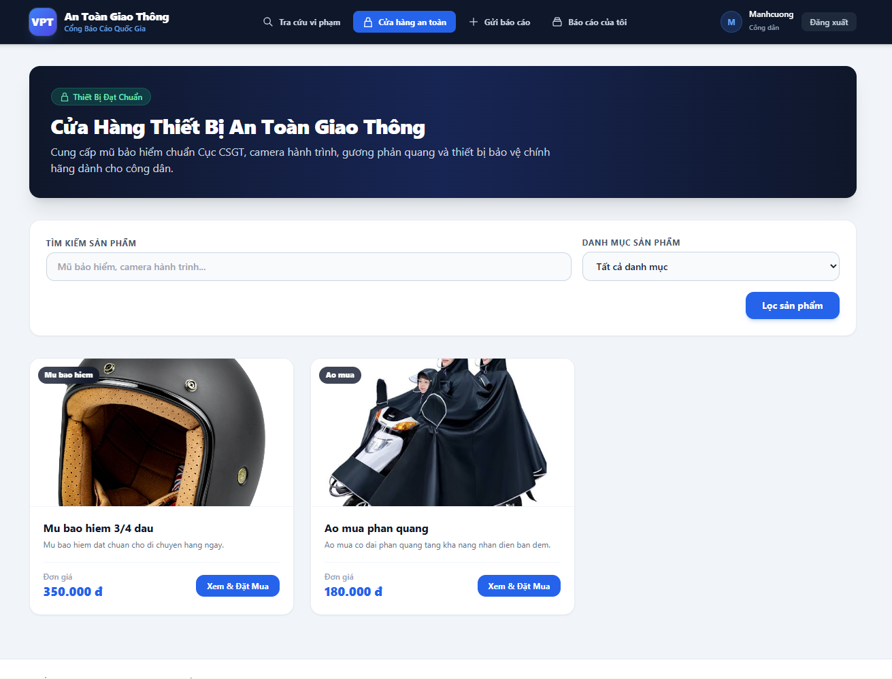

# VPT - Hệ Thống Báo Cáo Vi Phạm Giao Thông

Dự án Laravel dùng để tiếp nhận báo cáo vi phạm giao thông từ người dân, hỗ trợ cơ quan chức năng xác minh, quản lý mức phạt, tra cứu vi phạm và cung cấp cửa hàng thiết bị an toàn giao thông.

Source ban đầu là PHP/MySQL cũ. Dự án này được rebuild lại theo cấu trúc Laravel rõ ràng hơn: có migration, model, request validation, service upload ảnh, API, giao diện Blade, phân quyền admin/citizen và test tự động.

## Ảnh Demo

### Trang chủ / Tra cứu vi phạm



### Đăng nhập



### Đăng ký



### Gửi báo cáo vi phạm


### Danh sách báo cáo


### Quản lý báo cáo



### Cửa hàng thiết bị an toàn



## Chức Năng Chính

- Người dân đăng ký, đăng nhập và gửi báo cáo vi phạm giao thông.
- Upload ảnh bằng chứng cho báo cáo; local dùng `public` storage, production sẵn sàng dùng AWS S3.
- Gợi ý loại hành vi vi phạm khi người dân nhập báo cáo.
- Hiển thị mức phạt gợi ý theo từng hành vi vi phạm.
- Tra cứu vi phạm theo mã báo cáo hoặc biển số xe.
- Admin xem danh sách báo cáo, lọc theo trạng thái/biển số và cập nhật trạng thái xử lý.
- Admin sửa mô tả, mức phạt và thay ảnh bằng chứng của báo cáo.
- Admin quản lý sản phẩm cửa hàng: thêm, sửa, xóa, upload ảnh, giá và tồn kho.
- Người dân xem cửa hàng thiết bị an toàn và đặt mua sản phẩm.
- API cho auth, report, lookup, fine receipt, notification, product, order, news và statistics.
- Dashboard thống kê tổng quan, khu vực vi phạm nhiều, trạng thái xử lý và xu hướng theo ngày.

## Tài Khoản Demo

Sau khi chạy seed:

```text
Admin
Email: admin@vpt.local
Password: password

Citizen
Email: citizen@vpt.local
Password: password
```

## Công Nghệ Sử Dụng

- PHP 8.2
- Laravel 12
- Laravel Sanctum
- Blade + Tailwind CSS
- SQLite/MySQL
- Laravel Storage + AWS S3-ready
- PHPUnit
- Laravel Pint

## Cấu Trúc Chính

```text
app/
  Http/Controllers/      API controllers
  Http/Controllers/Web/  Web UI controllers
  Http/Requests/         Form request validation
  Models/                Eloquent models
  Services/              Upload/media services
config/
  traffic_violations.php Danh sách hành vi và mức phạt gợi ý
database/
  migrations/            Database schema
  seeders/               Demo data
resources/views/         Blade UI
routes/
  api.php                API routes
  web.php                Web routes
legacy-php/              Source cũ giữ lại để tham khảo
```

## Cài Đặt Local

```bash
composer install
cp .env.example .env
php artisan key:generate
php artisan migrate --seed
php artisan storage:link
php artisan serve
```

Mở trình duyệt:

```text
http://127.0.0.1:8000
```

Nếu port `8000` đang bận:

```bash
php artisan serve --host=127.0.0.1 --port=8001
```

## Cấu Hình Upload Ảnh

Mặc định local có thể dùng:

```env
FILESYSTEM_CLOUD=public
```

Khi AWS S3 đã sẵn sàng, đổi lại:

```env
FILESYSTEM_CLOUD=s3
AWS_ACCESS_KEY_ID=
AWS_SECRET_ACCESS_KEY=
AWS_DEFAULT_REGION=us-east-1
AWS_BUCKET=
AWS_URL=
AWS_ENDPOINT=
AWS_USE_PATH_STYLE_ENDPOINT=false
```

Upload được đóng gói trong:

```text
App\Services\MediaStorage
```

Database chỉ lưu:

```text
evidence_path / evidence_url
image_path / image_url
```

## API Tiêu Biểu

```http
POST /api/auth/register
POST /api/auth/login
GET  /api/auth/me
POST /api/auth/logout

GET  /api/reports
POST /api/reports
GET  /api/reports/{report}
PATCH /api/reports/{report}/status

GET /api/violations/lookup

GET /api/products
POST /api/products
GET /api/orders
POST /api/orders

POST /api/reports/{report}/fine-receipt
GET  /api/notifications

GET /api/statistics/overview
GET /api/statistics/locations
GET /api/statistics/statuses
GET /api/statistics/users
GET /api/statistics/trend
```

## Điểm Cải Tiến So Với Source Cũ

- Chuyển code PHP thủ công sang Laravel MVC.
- Tách rõ API controller và Web controller.
- Thêm migration và khóa ngoại thay vì thao tác database rời rạc.
- Dùng enum cho trạng thái báo cáo: `pending`, `verified`, `rejected`, `resolved`.
- Validation nằm trong Form Request, controller ngắn gọn hơn.
- Upload ảnh qua service riêng, dễ đổi giữa local và AWS S3.
- Tính tổng tiền đơn hàng ở backend, không tin giá từ client.
- Xử lý order bằng transaction và trừ tồn kho an toàn.
- Thêm role middleware để bảo vệ route admin.
- Thêm test tự động cho các workflow quan trọng.

## Kiểm Tra Chất Lượng

```bash
php artisan test
vendor/bin/pint
php artisan view:cache
php artisan view:clear
```

Kết quả gần nhất:

```text
php artisan test
35 passed, 141 assertions

vendor/bin/pint
passed
```

## Git Workflow

Quy trình làm việc của dự án:

```text
main
  |
  +-- develop
        |
        +-- feature/auth-role
        +-- feature/catalog-order-api
        +-- feature/aws-upload
        +-- feature/fine-notification
        +-- feature/violation-lookup
        +-- feature/report-statistics
        +-- feature/frontend-app
```

Quy tắc:

- Không code trực tiếp trên `main`.
- Tính năng mới làm trên `feature/*`.
- Merge vào `develop` sau khi test pass.
- Chỉ merge `develop` vào `main` khi dự án đã hoàn thiện và được xác nhận.
- Theo dõi tiến độ chi tiết trong [TIENDO.md](TIENDO.md).
